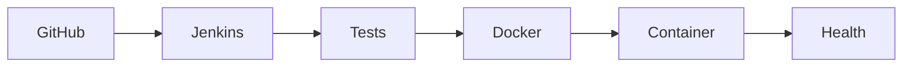

# Job Tracker DevOps CI/CD

A Spring Boot REST API for tracking job applications, delivered through a Jenkins and Docker CI/CD pipeline.

## Architecture

## API

| Method | Endpoint | Purpose |
|---|---|---|
| `GET` | `/api/jobs` | List tracked job applications |
| `POST` | `/api/jobs` | Create a job application |
| `GET` | `/actuator/health` | Application health check |

## Local Development

    cd app
    ./mvnw test
    ./mvnw spring-boot:run -Dspring-boot.run.arguments="--server.port=8082"

## Docker

    docker build -t job-tracker:0.1.0 .
    docker run --rm --name job-tracker -p 8081:8080 job-tracker:0.1.0

## CI/CD Pipeline

1. Jenkins checks out the GitHub repository.
2. Maven runs the automated tests.
3. Docker builds the application image.
4. Jenkins replaces the existing `job-tracker` container.
5. Jenkins checks `/actuator/health`.

## Current Scope

- H2 is used as an in-memory development database.
- Data resets when the application or container restarts.
- Jenkins is hosted locally on port `8080`.
- Jenkins deploys the application container on port `8081`.
